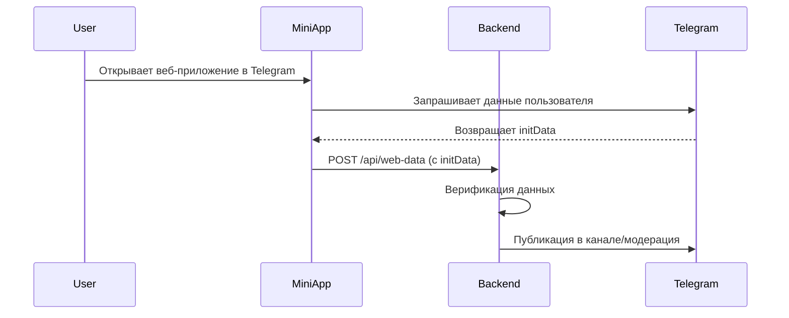

# Telegram Housing Rent Bot


Бот для размещения объявлений о аренде жилья с веб-интерфейсом и модерацией контента.

## 🌟 Особенности архитектуры

### 📱 Фронтенд (Mini App)
Веб-интерфейс реализован как **Telegram Mini App** на React и находится в [репозитории](https://github.com/moonssword/tg-web-app-react).

**Ключевые характеристики:**
- Полноценное SPA-приложение внутри Telegram
- Интеграция через Telegram WebApp API
- Отправка данных на текущий бэкенд через `/api/web-data`

### 🤖 Бэкенд (этот репозиторий)
- Обработка данных из Mini App
- Управление публикациями в каналах
- Модерация контента
- Работа с базой данных

## 🛠 Технологический стек

**Frontend (отдельный репозиторий)**
- React.js
- Telegram WebApp API

**Backend (этот репозиторий)**
- Node.js + Express
- PostgreSQL
- AWS S3 (хранение фото)
- node-telegram-bot-api

## 🔄 Взаимодействие компонентов



## 🚀 Запуск проекта

### Бэкенд (этот репозиторий)

```bash
git clone https://github.com/yourusername/housing-bot-backend.git
cd housing-bot-backend
npm install
cp .env.example .env
# Заполните настройки
npm start
```

## ⚙️ Конфигурация бэкенда

Важные переменные окружения для интеграции с Mini App:

```ini
DOMAIN=yourdomain.com # Должен совпадать с доменом фронтенда
TELEGRAM_BOT_TOKEN=your_bot_token
```

## 📌 Особенности интеграции

### Авторизация
Фронтенд передает initData для верификации пользователя:

```javascript
// В app.js
const isValid = verifyTelegramAuth(initData);
```

### Обмен данными
Пример endpoint для приема данных из Mini App:

```javascript
app.post('/api/web-data', async (req, res) => {
  const { initData } = req.body;
  // Обработка данных...
});
```

### CORS политики
Убедитесь, что ваш бэкенд разрешает запросы с домена фронтенда:

```javascript
app.use(cors({
  origin: ['https://yourdomain.com']
}));
```
